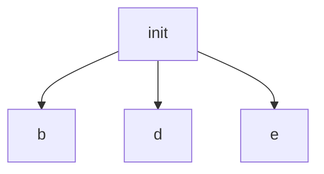

## Table Of Contents <!-- omit from toc -->
- [CPU Intro](#cpu-intro)
- [CPU API](#cpu-api)


## CPU Intro

### Homework

#### Question 1:
Run process-run.py with the following flags: -l 5:100,5:100.
What should the CPU utilization be (e.g., the percent of time the
CPU is in use?) Why do you know this? Use the -c and -p flags to
see if you were right.

Answer:
Utilization should be 100% because most scheduling algorithms wouldn't have any gap of runtime between two ready processes. In other words, both processes will always either be in the RUNNING, READY, or FINISHED state.

> Result:
> ```
> ./process-run.py -l 5:100,5:100 -c -p
> Time        PID: 0        PID: 1           CPU           IOs
>   1        RUN:cpu         READY             1          
>   2        RUN:cpu         READY             1          
>   3        RUN:cpu         READY             1          
>   4        RUN:cpu         READY             1          
>   5        RUN:cpu         READY             1          
>   6           DONE       RUN:cpu             1          
>   7           DONE       RUN:cpu             1          
>   8           DONE       RUN:cpu             1          
>   9           DONE       RUN:cpu             1          
>  10           DONE       RUN:cpu             1          
> 
> Stats: Total Time 10
> Stats: CPU Busy 10 (100.00%)
> Stats: IO Busy  0 (0.00%)
> ```


#### Question 2:
Now run with these flags: ./process-run.py -l 4:100,1:0.
These flags specify one process with 4 instructions (all to use the
CPU), and one that simply issues an I/O and waits for it to be done.
How long does it take to complete both processes? Use -c and -p
to find out if you were right.

Answer:
I believe the scheduling algorithm in this script will run the first process till in the DONE state, and then it'll run the process with I/O and just do nothing until the `io_done` which will complete process 2. We didn't specify the `L` flag for IO_LENGTH, so I'll assume it's just 1. Based on that, I think it'll be 4 for process 1 and then 1 for process 2 for a total of 5 with 80% CPU busy time and 20% I/O.

> Result:
> ```
> ./process-run.py -l 4:100,1:0 -c -p
> Time        PID: 0        PID: 1           CPU           IOs
>   1        RUN:cpu         READY             1          
>   2        RUN:cpu         READY             1          
>   3        RUN:cpu         READY             1          
>   4        RUN:cpu         READY             1          
>   5           DONE        RUN:io             1          
>   6           DONE       BLOCKED                           1
>   7           DONE       BLOCKED                           1
>   8           DONE       BLOCKED                           1
>   9           DONE       BLOCKED                           1
>  10           DONE       BLOCKED                           1
>  11*          DONE   RUN:io_done             1          
> 
> Stats: Total Time 11
> Stats: CPU Busy 6 (54.55%)
> Stats: IO Busy  5 (45.45%)
> ```

So the default IO_LENGTH is actually 5, and we kill 2 CPU cycles just initiating IO and finishing it.

#### Question 3:
Switch the order of the processes: -l 1:0,4:100. What happens
now? Does switching the order matter? Why? (As always, use -c
and -p to see if you were right)

Answer:
The CPU will start with the IO process and I'm assuming the scheduling algorithm is configured to run a process when waiting for IO. If it follows that algorithm, then it should be 1 io_run cpu cycle for process 1 followed by 4 cpu cycles for process 2 until it's done. And then we'll have a cycle of just waiting for the IO until it's finished with an io_done. This gives us a total of 7 cycles because process 2 can run and finish while waiting for the IO in process 1.

> Result:
> ```
> ./process-run.py -l 1:0,4:100 -c -p
> Time        PID: 0        PID: 1           CPU           IOs
>   1         RUN:io         READY             1          
>   2        BLOCKED       RUN:cpu             1             1
>   3        BLOCKED       RUN:cpu             1             1
>   4        BLOCKED       RUN:cpu             1             1
>   5        BLOCKED       RUN:cpu             1             1
>   6        BLOCKED          DONE                           1
>   7*   RUN:io_done          DONE             1          
> 
> Stats: Total Time 7
> Stats: CPU Busy 6 (85.71%)
> Stats: IO Busy  5 (71.43%)
> ```

#### Question 4:
We’ll now explore some of the other flags. One important flag is -S, which determines how the system reacts when a process issues an I/O. With the flag set to SWITCH ON END, the system will NOT switch to another process while one is doing I/O, instead waiting until the process is completely finished. What happens when you run the following two processes (-l 1:0,4:100 -c -S SWITCH ON END), one doing I/O and the other doing CPU work?

Answer:
It should be the same as the result from question 2, except the process order is flipped. So total time is 11 - 6 from CPU and 5 from IO.

> Result:
> ```
> ./process-run.py -l 1:0,4:100 -S SWITCH_ON_END -c -p
> Time        PID: 0        PID: 1           CPU           IOs
>   1         RUN:io         READY             1          
>   2        BLOCKED         READY                           1
>   3        BLOCKED         READY                           1
>   4        BLOCKED         READY                           1
>   5        BLOCKED         READY                           1
>   6        BLOCKED         READY                           1
>   7*   RUN:io_done         READY             1          
>   8           DONE       RUN:cpu             1          
>   9           DONE       RUN:cpu             1          
>  10           DONE       RUN:cpu             1          
>  11           DONE       RUN:cpu             1          
> 
> Stats: Total Time 11
> Stats: CPU Busy 6 (54.55%)
> Stats: IO Busy  5 (45.45%)
> ```

#### Question 5
Now, run the same processes, but with the switching behavior set
to switch to another process whenever one is WAITING for I/O (-l
1:0,4:100 -c -S SWITCH ON IO). What happens now? Use -c
and -p to confirm that you are right.

Answer:
This should be the same result as from question 3. Total time of 7 with 6 CPU and 5 I/O

> Result:
> ```
> ./process-run.py -l 1:0,4:100 -S SWITCH_ON_IO -c -p
> Time        PID: 0        PID: 1           CPU           IOs
>   1         RUN:io         READY             1          
>   2        BLOCKED       RUN:cpu             1             1
>   3        BLOCKED       RUN:cpu             1             1
>   4        BLOCKED       RUN:cpu             1             1
>   5        BLOCKED       RUN:cpu             1             1
>   6        BLOCKED          DONE                           1
>   7*   RUN:io_done          DONE             1          
> 
> Stats: Total Time 7
> Stats: CPU Busy 6 (85.71%)
> Stats: IO Busy  5 (71.43%)
> ```

#### Question 6
One other important behavior is what to do when an I/O completes. With -I IO RUN LATER, when an I/O completes, the process that issued it is not necessarily run right away; rather, whatever was running at the time keeps running. What happens when you run this combination of processes? (./process-run.py -l
3:0,5:100,5:100,5:100 -S SWITCH ON IO -c -p -I
IO RUN LATER) Are system resources being effectively utilized?

Answer:
So we have 4 processes. The first one is 3 IO calls and each IO call takes 5 time units. The other 3 processes are 100% CPU bound and each also take 5 time units to run. With the IO_RUN_LATER flag, I'm not sure if the first process initiates the 2nd IO call before the 3rd process starts. If it does, then I assume it should be 21 time units with 15 IO and all IO BLOCKED time spent running other processes. If the 2nd IO call waits for all the processes to run first, then you add 10 time units to what I just mentioned with those units wasted in CPU free time during IO blocks.

> Result:
> ```
> ./process-run.py -l 3:0,5:100,5:100,5:100 -S SWITCH_ON_IO -c -p -I IO_RUN_LATER
> Time        PID: 0        PID: 1        PID: 2        PID: 3           CPU           IOs
>   1         RUN:io         READY         READY         READY             1          
>   2        BLOCKED       RUN:cpu         READY         READY             1             1
>   3        BLOCKED       RUN:cpu         READY         READY             1             1
>   4        BLOCKED       RUN:cpu         READY         READY             1             1
>   5        BLOCKED       RUN:cpu         READY         READY             1             1
>   6        BLOCKED       RUN:cpu         READY         READY             1             1
>   7*         READY          DONE       RUN:cpu         READY             1          
>   8          READY          DONE       RUN:cpu         READY             1          
>   9          READY          DONE       RUN:cpu         READY             1          
>  10          READY          DONE       RUN:cpu         READY             1          
>  11          READY          DONE       RUN:cpu         READY             1          
>  12          READY          DONE          DONE       RUN:cpu             1          
>  13          READY          DONE          DONE       RUN:cpu             1          
>  14          READY          DONE          DONE       RUN:cpu             1          
>  15          READY          DONE          DONE       RUN:cpu             1          
>  16          READY          DONE          DONE       RUN:cpu             1          
>  17    RUN:io_done          DONE          DONE          DONE             1          
>  18         RUN:io          DONE          DONE          DONE             1          
>  19        BLOCKED          DONE          DONE          DONE                           1
>  20        BLOCKED          DONE          DONE          DONE                           1
>  21        BLOCKED          DONE          DONE          DONE                           1
>  22        BLOCKED          DONE          DONE          DONE                           1
>  23        BLOCKED          DONE          DONE          DONE                           1
>  24*   RUN:io_done          DONE          DONE          DONE             1          
>  25         RUN:io          DONE          DONE          DONE             1          
>  26        BLOCKED          DONE          DONE          DONE                           1
>  27        BLOCKED          DONE          DONE          DONE                           1
>  28        BLOCKED          DONE          DONE          DONE                           1
>  29        BLOCKED          DONE          DONE          DONE                           1
>  30        BLOCKED          DONE          DONE          DONE                           1
>  31*   RUN:io_done          DONE          DONE          DONE             1          
> 
> Stats: Total Time 31
> Stats: CPU Busy 21 (67.74%)
> Stats: IO Busy  15 (48.39%)
> ```

#### Question 7
Now run the same processes, but with -I IO RUN IMMEDIATE set,
which immediately runs the process that issued the I/O. How does
this behavior differ? Why might running a process that just completed an I/O again be a good idea?

Answer:
This should run as I expected it to run in question 6. Total of 21 time units with 15 IO and 21 CPU. It could be good in case you need to initiate more IO so you dont waste CPU utilization.

> Result:
> ```
> ./process-run.py -l 3:0,5:100,5:100,5:100 -S SWITCH_ON_IO -c -p -I IO_RUN_IMMEDIATE
> Time        PID: 0        PID: 1        PID: 2        PID: 3           CPU           IOs
>   1         RUN:io         READY         READY         READY             1          
>   2        BLOCKED       RUN:cpu         READY         READY             1             1
>   3        BLOCKED       RUN:cpu         READY         READY             1             1
>   4        BLOCKED       RUN:cpu         READY         READY             1             1
>   5        BLOCKED       RUN:cpu         READY         READY             1             1
>   6        BLOCKED       RUN:cpu         READY         READY             1             1
>   7*   RUN:io_done          DONE         READY         READY             1          
>   8         RUN:io          DONE         READY         READY             1          
>   9        BLOCKED          DONE       RUN:cpu         READY             1             1
>  10        BLOCKED          DONE       RUN:cpu         READY             1             1
>  11        BLOCKED          DONE       RUN:cpu         READY             1             1
>  12        BLOCKED          DONE       RUN:cpu         READY             1             1
>  13        BLOCKED          DONE       RUN:cpu         READY             1             1
>  14*   RUN:io_done          DONE          DONE         READY             1          
>  15         RUN:io          DONE          DONE         READY             1          
>  16        BLOCKED          DONE          DONE       RUN:cpu             1             1
>  17        BLOCKED          DONE          DONE       RUN:cpu             1             1
>  18        BLOCKED          DONE          DONE       RUN:cpu             1             1
>  19        BLOCKED          DONE          DONE       RUN:cpu             1             1
>  20        BLOCKED          DONE          DONE       RUN:cpu             1             1
>  21*   RUN:io_done          DONE          DONE          DONE             1          
> 
> Stats: Total Time 21
> Stats: CPU Busy 21 (100.00%)
> Stats: IO Busy  15 (71.43%)
> ```

#### Question 8:
Now run with some randomly generated processes using flags -s
1 -l 3:50,3:50 or -s 2 -l 3:50,3:50 or -s 3 -l 3:50,3:50. See if you can predict how the trace will turn out. What happens when you use the flag -I IO RUN IMMEDIATE versus that flag -I IO RUN LATER? What happens when you use the flag -S SWITCH ON IO versus -S SWITCH ON END?

Answer:
I think the default random processes would run well - effectively using the CPU while waiting for IO. I think that if you switch to IO_RUN_LATER, then you'll significantly extend the total time with the CPU not being used much during IO blocks. You'll see a similar issue with the switching flags - SWITCH_ON_IO should be a lot more efficient.

> Results:
> ```
> # Seed 2; IO_RUN_IMMEDIATE; SWITCH_ON_IO
> ./process-run.py -s 2 -l 3:50,3:50 -c -p -I IO_RUN_IMMEDIATE -S SWITCH_ON_IO
> Time        PID: 0        PID: 1           CPU           IOs
>   1         RUN:io         READY             1          
>   2        BLOCKED       RUN:cpu             1             1
>   3        BLOCKED        RUN:io             1             1
>   4        BLOCKED       BLOCKED                           2
>   5        BLOCKED       BLOCKED                           2
>   6        BLOCKED       BLOCKED                           2
>   7*   RUN:io_done       BLOCKED             1             1
>   8         RUN:io       BLOCKED             1             1
>   9*       BLOCKED   RUN:io_done             1             1
>  10        BLOCKED        RUN:io             1             1
>  11        BLOCKED       BLOCKED                           2
>  12        BLOCKED       BLOCKED                           2
>  13        BLOCKED       BLOCKED                           2
>  14*   RUN:io_done       BLOCKED             1             1
>  15        RUN:cpu       BLOCKED             1             1
>  16*          DONE   RUN:io_done             1          
> 
> Stats: Total Time 16
> Stats: CPU Busy 10 (62.50%)
> Stats: IO Busy  14 (87.50%)
> ```
> 
> ```
> # Seed 2; IO_RUN_LATER; SWITCH_ON_END
> ./process-run.py -s 2 -l 3:50,3:50 -c -p -I IO_RUN_LATER -S SWITCH_ON_END
> Time        PID: 0        PID: 1           CPU           IOs
>   1         RUN:io         READY             1          
>   2        BLOCKED         READY                           1
>   3        BLOCKED         READY                           1
>   4        BLOCKED         READY                           1
>   5        BLOCKED         READY                           1
>   6        BLOCKED         READY                           1
>   7*   RUN:io_done         READY             1          
>   8         RUN:io         READY             1          
>   9        BLOCKED         READY                           1
>  10        BLOCKED         READY                           1
>  11        BLOCKED         READY                           1
>  12        BLOCKED         READY                           1
>  13        BLOCKED         READY                           1
>  14*   RUN:io_done         READY             1          
>  15        RUN:cpu         READY             1          
>  16           DONE       RUN:cpu             1          
>  17           DONE        RUN:io             1          
>  18           DONE       BLOCKED                           1
>  19           DONE       BLOCKED                           1
>  20           DONE       BLOCKED                           1
>  21           DONE       BLOCKED                           1
>  22           DONE       BLOCKED                           1
>  23*          DONE   RUN:io_done             1          
>  24           DONE        RUN:io             1          
>  25           DONE       BLOCKED                           1
>  26           DONE       BLOCKED                           1
>  27           DONE       BLOCKED                           1
>  28           DONE       BLOCKED                           1
>  29           DONE       BLOCKED                           1
>  30*          DONE   RUN:io_done             1          
> 
> Stats: Total Time 30
> Stats: CPU Busy 10 (33.33%)
> Stats: IO Busy  20 (66.67%)
> ```

## CPU API

### Homework (Simulation)

#### Question 1
Run ./fork.py -s 10 and see which actions are taken. Can you
predict what the process tree looks like at each step? Use the -c
flag to check your answers. Try some different random seeds (-s)
or add more actions (-a) to get the hang of it.

Answer: Running `./fork.py -s 10` results in below:
```
Action: a forks b
Process Tree?
Action: a forks c
Process Tree?
Action: c EXITS
Process Tree?
Action: a forks d
Process Tree?
Action: a forks e
Process Tree?
```

The final process tree should look like this:


> Result:
> ```
>  a
>  ├── b
>  ├── d
>  └── e
> ```

#### Question 2
One control the simulator gives you is the fork_percentage, controlled by the -f flag. The higher it is, the more likely the next action is a fork; the lower it is, the more likely the action is an exit.
Run the simulator with a large number of actions (e.g., -a 100)
and vary the fork_percentage from 0.1 to 0.9. What do you
think the resulting final process trees will look like as the percentage changes? Check your answer with -c.

Answer: I think the height of the process tree will increase as you increase the fork_percentage. This is because when parents of a child process exits before the child is finished, the child should be inherited by the init process.

Results:
```
# ./fork.py -s 4 -a 100 -f 0.1 -F -c
                        Final Process Tree:
                              a
```

```
# ./fork.py -s 4 -a 100 -f 0.5 -F -c

                        Final Process Tree:
                               a
                               ├── U
                               │   └── X
                               ├── W
                               └── Y
                                   └── Z
                                       ├── aa
                                       │   └── ac
                                       └── ab
```

#### Question 3
Now, switch the output by using the -t flag (e.g., run ./fork.py
-t). Given a set of process trees, can you tell which actions were
taken?

Answer: Output of `./fork.py -t`
```
                           Process Tree:
                               a

Action?
                               a
                               └── b
Action?
                               a
                               ├── b
                               └── c
Action?
                               a
                               ├── b
                               ├── c
                               └── d
Action?
                               a
                               ├── b
                               ├── c
                               ├── d
                               └── e
Action?
                               a
                               ├── b
                               ├── c
                               ├── d
                               │   └── f
                               └── e
```

Actions should be:
1. a forks b
2. a forks c
3. a forks d
4. a forks e
5. d forks f

#### Question 4
One interesting thing to note is what happens when a child exits;
what happens to its children in the process tree? To study this, let’s
create a specific example: ./fork.py -A a+b,b+c,c+d,c+e,c-.
This example has process ’a’ create ’b’, which in turn creates ’c’,
which then creates ’d’ and ’e’. However, then, ’c’ exits. What do
you think the process tree should like after the exit? What if you
use the -R flag? Learn more about what happens to orphaned processes on your own to add more context.

Answer: Like I said for question 2, I think orphaned processes are just inherited by the init process.

Result: Answer was correct, and with the `-R` flag, the children of the orphaned process get inherited by the orphan's direct parent.

#### Question 5
One last flag to explore is the -F flag, which skips intermediate
steps and only asks to fill in the final process tree. Run ./fork.py
-F and see if you can write down the final tree by looking at the
series of actions generated. Use different random seeds to try this a
few times.

Answer: Output of `./fork.py -s 1 -F`

```
                           Process Tree:
                               a

Action: a forks b
Action: a forks c
Action: c forks d
Action: a forks e
Action: c EXITS

                        Final Process Tree?
```

Final Process Tree should look like:


Result:
```
Final Process Tree:
                               a
                               ├── b
                               ├── e
                               └── d
```

#### Question 6
Finally, use both -t and -F together. This shows the final process
tree, but then asks you to fill in the actions that took place. By looking at the tree, can you determine the exact actions that took place?
In which cases can you tell? In which can’t you tell? Try some different random seeds to delve into this question.

Answer: No you can't really tell what actions took place unless you know the number of actions and if you have some edge cases where you have as many distinct nodes as actions. Missing nodes could have previously existed anywhere.


### Homework (Code)

#### Question 1
Write a program that calls fork(). Before calling fork(), have the main process access a variable (e.g., x) and set its value to something (e.g., 100). What value is the variable in the child process? What happens to the variable when both the child and parent change the value of x?

Answer:

```c
#include <stdio.h>
#include <stdlib.h>
#include <unistd.h>

int main(int argc, char *argv[])
{
  int x = 50;
  x = 100;
  int rc = fork();
  if (rc < 0) {
    // failed fork
    printf("failed to fork process: %d\n", rc);
  } else if (rc == 0) {
    // child process
    printf("child value of x: %d\n", x); // 100
    x = 25;
    printf("child 2nd x: %d\n", x); // 25
  } else {
    // parent continues
    printf("parent continued value of x: %d\n", x); // 100
    x = 75;
    printf("parent 2nd x: %d\n", x); // 75
  }
  return 0;
}
```

The integer `x` retains the same virtual address, but as we know child and parent processes don't share physical memory space, so the child basically copies `x` when it forks. Both the child and parent can modify `x` at the same time, because they're not the same variable (in memory).

#### Question 2
