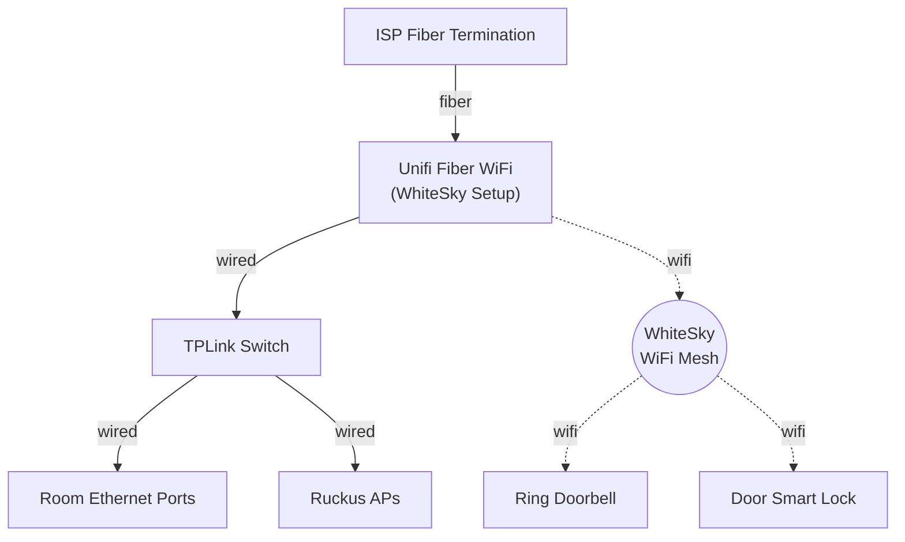

## Defining scope

At the start of most OPSEC projects, people usually define their "threat model" - what/who they need to protect their information from and to what extent. As many of you know, we're living in an age where personal data is increasingly commoditized and our right to it abused. My goals with OPSEC are as follows:

1. I do not want to have a consistent fingerprint across the web - regardless of desktop or mobile.
2. I do not want private third parties having access to my personal and financial information. This includes things like my current residential address, my personal phone number, my biometrics, my credit report, my list of owned assets, and where I spend my money.
3. I do not want anyone to track my location including where I shop, eat, visit, and spend time.
4. I do not want to provide access to data stored on any of my devices unless provided with reasonable cause to the request.
5. I do not want my shopping/eating/travel/communication habits modeled and predicted.

I believe these are pretty reasonable goals, but the more I research into OPSEC, the more it's apparent how difficult it can be to reach this level of privacy. But like it's said about many things, privacy is a marathon, not a sprint.

## Digital Privacy
### Home Network

I live in an apartment complex that forces a bulk internet plan through [WhiteSky](https://www.whitesky.us/), and I don't really want to share all my network traffic with them. Unlike with a traditional ISP plan offered through Google Fiber or AT&T, we don't really have control over network here. The architecture currently looks like this:

WhiteSky's networking is configured to the apartment's Ringly app which the leasing office also has access to, and I don't want to mess that up. So in order to add my personal network to their existing one, we'll be running a double NAT setup like below:

```mermaid
flowchart TD
    ISP["ISP Fiber Termination"]

    MIKROTIK["My Mikrotik Router"]

    ISP -->|fiber| UNIFI
    UNIFI -->|wired| MIKROTIK
    UNIFI -.->|wifi| WHITESKY

    subgraph WHITESKY_NET["WhiteSky Network"]
        UNIFI["Unifi Fiber WiFi<br/>(WhiteSky Setup)"]
        WHITESKY(("WhiteSky<br/>WiFi Mesh"))
        RING["Ring Doorbell"]
        LOCK["Door Smart Lock"]
        WHITESKY -.->|wifi| RING
        WHITESKY -.->|wifi| LOCK
    end

    subgraph MIKROTIK_NET["My Network"]
        SWITCH["TPLink Switch"]
        PORTS["Room Ethernet Ports"]
        TPLINK["My TPLink APs"]
        MIKROTIK -->|wired| SWITCH
        SWITCH -->|wired| PORTS
        SWITCH -->|wired| TPLINK
    end

    style WHITESKY_NET fill:#2b2140,stroke:#8b5cf6,stroke-width:2px
    style MIKROTIK_NET fill:#1a2e35,stroke:#22d3ee,stroke-width:2px
```

This gives me control to my own network, but WhiteSky is still able to see all of my WAN traffic. In order to prevent that, I'm going to create policy rules to route certain traffic through a VPN like Proton VPN. We're also going to force DNS over HTTPS (DoH) to Quad9 and Cloudflare without routing through the VPN for reducing latency.

Although securing DNS, HTTPS traffic that isn't routed through a VPN can still be logged and identified by WhiteSky exposed by [SNI](http://cloudflare.com/learning/ssl/what-is-sni/), which to be clear, only exposes the domains that you're handshaking with and not the content of your payloads. There is Encrypted SNI (ESNI), but from what I've read, it's not really widely adopted. I'm still trying to figure out a good workaround for this.

### Phone

